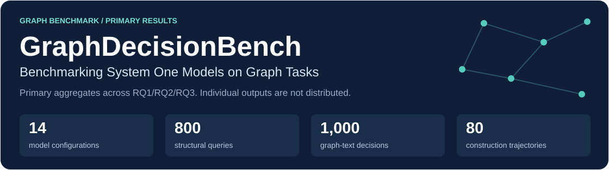
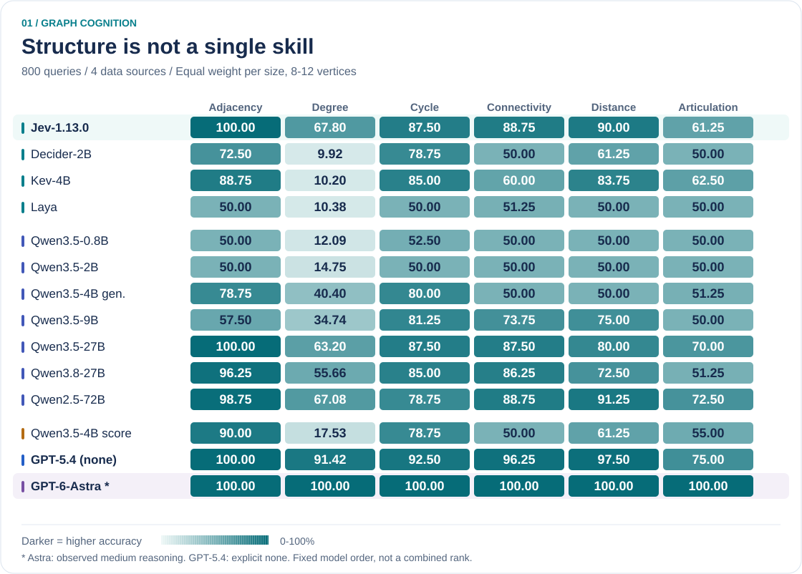
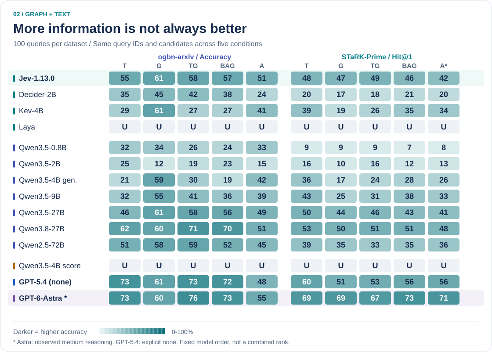
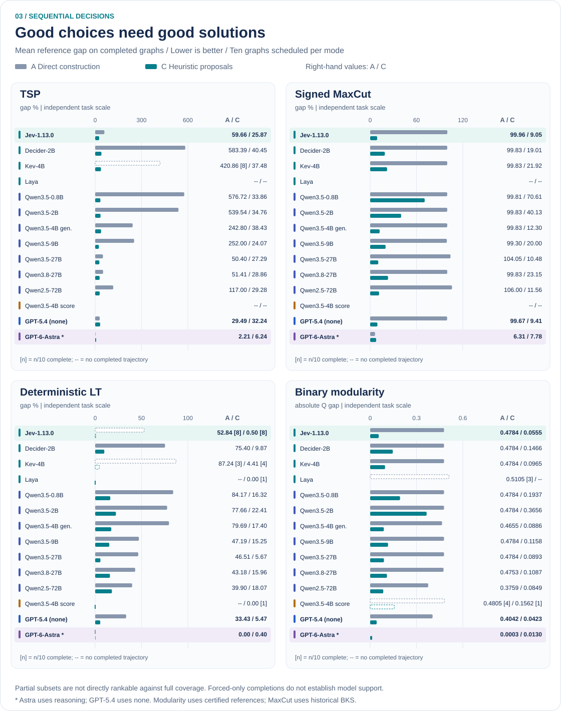

<p align="center">
  
</p>

<p align="center">
  <a href="#key-findings"><b>Highlights</b></a> &nbsp;·&nbsp;
  <a href="#rq1--graph-cognition">Graph cognition</a> &nbsp;·&nbsp;
  <a href="#rq2--graph-and-text">Graph + text</a> &nbsp;·&nbsp;
  <a href="#rq3--sequential-decisions">Sequential decisions</a> &nbsp;·&nbsp;
  <a href="docs/results.md">Full tables</a> &nbsp;·&nbsp;
  <a href="#configuration">Configuration</a> &nbsp;·&nbsp;
  <a href="#citation">Cite</a>
</p>

**How well do fast decision models understand graphs—and turn choices into good solutions?**
GraphDecisionBench compares Jev, related native selectors and language models through
three complementary tests. The benchmark is model-independent; a common choice
interface does not imply a common architecture or reasoning budget.

**Primary results · October 2026.** All figures below use the primary
aggregate results, not the older supporting experiments. GPT‑5.4 uses **no reasoning**;
GPT‑6‑Astra is a **reasoning-enabled reference**. There is no cross-task overall rank.
The experiments span **fourteen model-interface configurations across RQ1, RQ2
and RQ3**, with unsupported interfaces explicitly marked. The
[summary data](data/results/summary.json) supply all charts and full tables;
per-query and per-trajectory outputs are not distributed in the public bundle.

## Key findings

| Graph cognition | Graph + text | Sequential decisions |
| :--- | :--- | :--- |
| **Local recognition ≠ structural mastery.** | **More evidence ≠ better decisions.** | **Completion ≠ solution quality.** |
| Jev reaches **100% adjacency**, but **67.80% degree** and **61.25% articulation**. | Jev's explicit-edge gain is **+1 pp** on arXiv and **+3 pp** on Prime; both paired intervals include zero. | Proposals reduce Jev's TSP gap from **59.66% to 25.87%**, yet a fixed proposal rule reaches **15.58%**. |

The value of GraphDecisionBench is the **profile**, not a single leaderboard score:
structural correctness, information utility and construction quality answer
different questions.

## RQ1 — Graph cognition

**Six tasks · four real networks · 8–12 vertices · 800 queries per configuration.**



<p align="center">
  <a href="assets/benchmark/structural-queries.svg">Full-size figure</a> ·
  <a href="docs/results.md#rq1-size-equal-task-accuracy-">Exact values</a>
</p>

- **Jev is strong but uneven.** It matches the large-model baselines on
  adjacency, but the gap on degree and articulation is substantial.
- **Scale weighting matters.** The primary task metric gives each graph size
  equal weight rather than pooling queries.
- **The strongest reference is not compute-matched.** Astra reaches 100%
  across the six tasks with reasoning enabled.

<details>
<summary><b>Metric and dataset notes</b></summary>

Sources: Facebook, ca-GrQc, Power Grid and Human PPI, 200 queries each.
There are 400 degree questions and 80 for each other task. The primary task
score averages accuracy equally across sizes 8–12; illegal outputs count as
incorrect. Labels are computed on exactly the supplied graph, including isolates.

The heatmap uses the primary results; each task is a separate comparison,
not part of a blended score.

</details>

## RQ2 — Graph and text

**Two datasets · five matched inputs · 100 test queries per dataset and condition.**



<p align="center">
  <a href="assets/benchmark/graph-text-decisions.svg">Full-size figure</a> ·
  <a href="docs/results.md#rq2-ogbn-arxiv-accuracy-">arXiv table</a> ·
  <a href="docs/results.md#rq2-stark-prime-hit1-">Prime table</a>
</p>

**T** = text · **G** = relations · **TG** = joint input ·
**BAG** = TG without explicit edges · **A/A\*** = comparator without additional entity text or edges.

### Do explicit edges add value?

| Jev paired contrast | ogbn-arxiv | STaRK-Prime |
| --- | ---: | ---: |
| **TG − BAG:** explicit edges, same accompanying text | **+1 pp** [−4, +7] | **+3 pp** [−6, +12] |
| **G − A/A\*:** relations without additional entity text | **+10 pp** [+3, +18] | **+5 pp** [−5, +14] |

Intervals are paired, pointwise 95% bootstrap intervals—not recoverable from
aggregate correct counts. **Relational input helps Jev over arXiv anchors
alone, but adding edges to text-rich input has no clear positive effect.**
High TG accuracy and a positive TG−BAG gain are different claims.

<details>
<summary><b>What these comparisons do—and do not—measure</b></summary>

- arXiv has forty classes and shared training-label anchors. Context identities
  are graph-selected even in T, so it is not a graph-independent baseline.
  TG−T adds context text as well as edges.
- Prime is **selection within forty gold-containing candidates**, not
  end-to-end retrieval. A missing native answer is inserted deterministically
  into BM25 top-40; candidates are shuffled without answer markers.
  Candidate Hit@40 is 100% by design; Recall@40 is 77.7241%.
- `U` means unsupported, not zero accuracy. Invalid outputs count as wrong.
- arXiv macro-F1 averages over the fixed forty classes, including zero F1 for
  classes absent from both truth and predictions. It cannot be inferred from
  binary correctness alone.

</details>

## RQ3 — Sequential decisions

**Four optimization tasks · ten graphs each · direct actions versus heuristic proposals.**



<p align="center">
  <a href="assets/benchmark/optimization-trajectories.svg">Full-size figure</a> ·
  <a href="docs/results.md#rq3-tsp--gap">Exact gaps and coverage</a>
</p>

**A — Direct construction:** choose among all legal next actions.

**C — Heuristic-proposal selection:** choose among distinct next actions
proposed by four fixed rules. A singleton is forced, without a model call.

### Proposals help—but how much is the model contributing?

| Jev task | Direct gap | Proposal gap | Fixed-rule comparison | Complete A / C |
| --- | ---: | ---: | --- | --- |
| TSP | 59.66% | **25.87%** | `return_reserve`: **15.58%** | 10/10 · 10/10 |
| Signed MaxCut | 99.96% | **9.05%** | `greedy_completion`: **8.87%** | 10/10 · 10/10 |
| Deterministic LT | 52.84% | **0.50%** | Partial cohort—compare on matched graphs | **8/10 · 8/10** |
| Binary modularity | 0.4784 Q | **0.0555 Q** | `greedy_completion`: **0.0361 Q** | 10/10 · 10/10 |

Lower is better. Strong improvement over direct construction does **not**
establish improvement over the proposal rules themselves. Proposals also do
not help every configuration: GPT‑5.4's TSP gap increases from **29.49% to
32.24%**; Astra's direct policy is better than its proposal policy on all four tasks.

<details>
<summary><b>Coverage, references and fair comparisons</b></summary>

- Across fourteen configurations, **951/1,120 trajectories complete**,
  165 are unsupported and four fail. Jev completes 76/80; its four failures are
  context-capacity HTTP errors on the two 150-node LT graphs, in both modes.
- Means use completed trajectories. Compare modes and controls on the same
  completed-instance subset; a partial result is not rankable against a
  full-ten-graph result. Forced-only completion does not establish interface support.
- TSP uses published optima, LT exhaustive two-seed optima, signed MaxCut
  historical 2016 BKS, and binary modularity numerical MILP-certified optima.
  TSP/LT/MaxCut gaps are $|f_i-R_i|/R_i\times100$ with positive references,
  reported in percent; modularity uses $Q_i^*-Q_i$ in **absolute Q units**.
  No completed primary solution in the three percentage-gap tasks improves on its reference.
- Modularity residuals retain their sign. Non-GPT modularity objectives were rounded to
  four decimals before rebasing; additional printed digits are not extra precision.

</details>

## Results, data and scope

| Resource | What it contains |
| --- | --- |
| [Complete result tables](docs/results.md) | All fourteen configurations, taskwise scores, gaps and completion counts |
| [Figure source data](data/results/summary.json) | Manuscript-transcribed aggregates for fourteen configurations; all charts and full tables share this source |
| [Result scope and provenance](data/results/README.md) | Aggregate schema, metrics and interpretation limits across all fourteen configurations |
| [Dataset documentation](data/README.md) | Source downloads, normalization and the optimization catalog |
| [Workflow configurations](configs/README.md) | YAML coverage, action parameters, previews, permissions and artifact prerequisites for every public task workflow |
| [Reproduction and model settings](docs/reproduction.md) | Offline reporting, configuration, tests and fresh-clone limitations |

Historical and supplementary experiments are **independent cohorts**, with
different sampling, candidate pools or reference values. Their assets are not
distributed in the current compact bundle and have not been pooled into the
primary results. Charts and tables render from the aggregate summary, not raw
response replay; aggregate values do not reconstruct individual model outputs.

**Readouts differ.** Native selection, Qwen constrained generation and
candidate-token scoring retain their own support limits. GPT‑5.4 uses
`reasoning_effort="none"` with verified zero reasoning tokens; Astra uses
observed medium reasoning. Copilot's tool enum is not verified strict
decoding. These comparisons do not establish a matched-hardware speed ranking.

## Configuration

All public task and result workflows use [run_benchmark.py](run_benchmark.py)
with YAML configurations. See the [configuration guide](configs/README.md) for
synthetic development, six-task real-network evaluation, graph-text,
optimization, supplied-input proposals and aggregate reporting.

```bash
# Configuration-only preview: no runner, artifact checks, downloads or inference.
python run_benchmark.py --config configs/development.yaml --check
# Actual offline consistency check of the distributed aggregate presentation.
python run_benchmark.py --config configs/results.yaml
```

All configs use `schema_version: 1`. Workflow configs select one explicitly
configured action; they never chain actions. The three topology-format
adjacency/distance smoke configs remain compatible, not
primary-cohort reproductions. Every `run` requires `--allow-inference`;
download-capable actions require `--allow-downloads`, even if cached. Existing
approval and integrity gates still apply. A successful preview does not mean
the required artifacts exist or that a primary experiment can be reproduced.

### Optional live interface smoke

After separately starting a local vLLM server, an optional bounded check is:

```bash
python -m src.utils.live_smoke --provider vllm --model YOUR_SERVED_MODEL --base-url http://127.0.0.1:8000/v1 --output output/runtime/live-smoke-local --allow-inference
```

Alternatively use `--provider github_copilot --model gpt-5.4` without `--base-url`,
with authentication configured separately. Use a fresh output directory each time.
This checks **12 synthetic task types**: adjacency, degree, cycle, pair connectivity,
distance threshold, articulation, arXiv-style classification, Prime-style 40-choice
selection, TSP, MaxCut, deterministic LT and binary modularity. It uses one instance
per type, direct arm A for construction and TG for graph-text (not an A/C comparison).
These fixtures are **not primary reproduction**, and there is **no accuracy guarantee**.
The runner downloads nothing, starts no model, makes no calls without opt-in, uses
45-second call limits and an approximately 600-second total budget, and never retries.
Slow constructions may remain incomplete so later task types can be attempted.
Copilot SDK-internal retries cannot be disabled by this adapter; observed retries
are rejected and reported, not silently treated as one call.
The summary separates observed transport attempts, protocol completion and semantic
results; every type must have a call observed, not just forced steps. Counts are
outbound HTTP attempts or observed SDK turns, not proof of server-side forward counts.
Traces contain normalized responses and sanitized transport metadata, not provider
error bodies. Exit codes: 0 for complete interface coverage (not accuracy), 1 for
incomplete/failed coverage, 2 for CLI/setup refusal. No live outcome is asserted here.

## Citation

If you use the benchmark, code or results, please cite the
[GraphDecisionBench paper](https://arxiv.org/abs/2610.06354). For code-based
experiments, also identify the package version or commit used:

```bibtex
@misc{graphdecisionbench2026,
  title        = {GraphDecisionBench: Benchmarking System One Models on Graph Tasks},
  author       = {Yang, Xianliang and Zhang, Yapu and Zhao, Li},
  year         = {2026},
  eprint       = {2610.06354},
  archivePrefix = {arXiv},
  primaryClass = {cs.AI},
  doi          = {10.48550/arXiv.2610.06354},
  url          = {https://arxiv.org/abs/2610.06354}
}
```

[Machine-readable citation](CITATION.cff). The unversioned arXiv link points to
the latest available paper revision. Code is maintained in the
[GraphDecisionBench repository](https://github.com/VictorYXL/GraphDecisionBench).
If reusing data,
also cite the original sources: [SNAP](https://snap.stanford.edu/data/),
[Power Grid](https://websites.umich.edu/~mejn/netdata/),
[BioSNAP](https://snap.stanford.edu/biodata/),
[OGB](https://ogb.stanford.edu/docs/nodeprop/#ogbn-arxiv),
[STaRK](https://stark.stanford.edu/),
[TSPLIB](http://comopt.ifi.uni-heidelberg.de/software/TSPLIB95/) and
[OPTSICOM](https://grafo.etsii.urjc.es/optsicom/maxcut.html).
Source-specific provenance and citation requirements are described in the
[data documentation](data/README.md).
