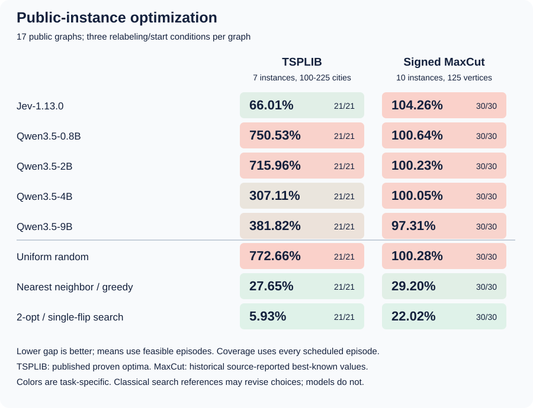
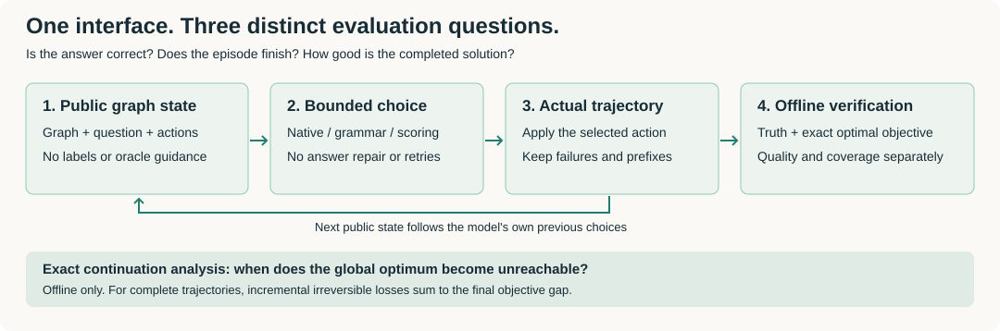
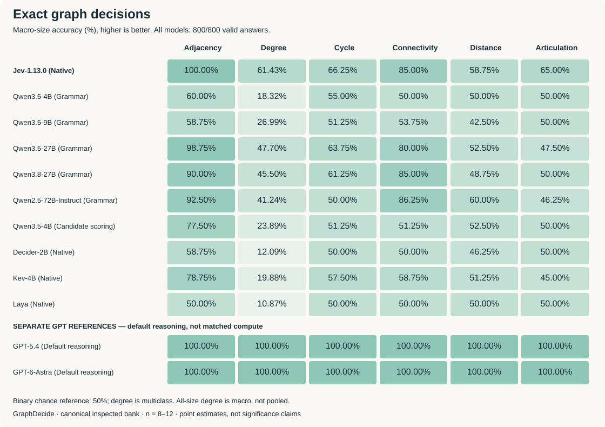
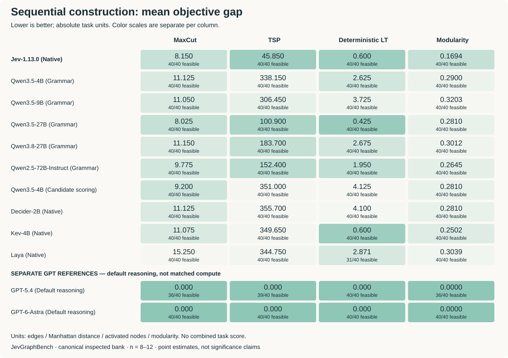
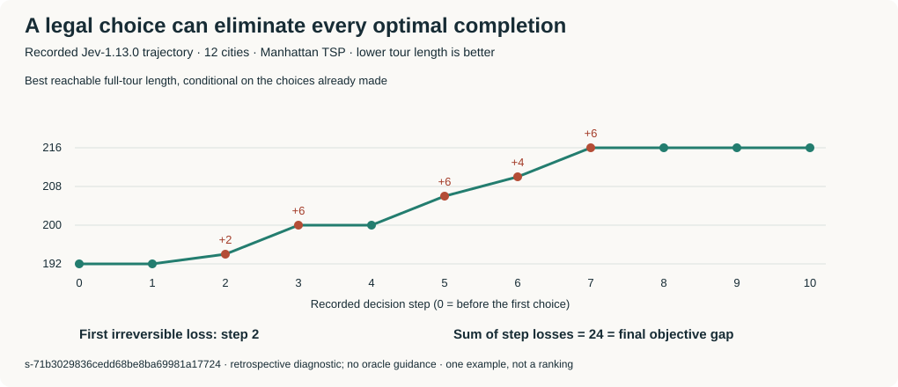

# GraphDecide

### Benchmarking Decision Models on Graphs

**Fast decisions are useful only if they produce good graph solutions.**
GraphDecide evaluates decision-oriented models through public-instance
optimization and controlled graph-reasoning diagnostics. The repository URL
and Python package retain the existing JevGraphBench name.

**[Paper: GraphDecide (v25, PDF)](assets/paper/GraphDecide_no_code_v25.pdf)**
— 8 main-text pages, with public-instance results and the action-abstraction
diagnostic in Appendix H (pages 25–29).

| Evaluation panel | Tasks and scale | Model configurations | Scheduled evaluations |
| --- | --- | --- | --- |
| **Public optimization** | 7 TSPLIB instances, 100–225 cities; 10 signed MaxCut graphs, 125 vertices | Jev + four Qwen3.5 models | **255 trajectories**: 17 graphs × 3 conditions × 5 models |
| **Action abstraction** | Same 7 TSPLIB instances; frozen four-rule pool | Jev + Qwen3.5-4B / 9B | **126 new trajectories**, plus 63 reused direct-action trajectories |
| **Controlled diagnostics** | 6 graph queries + 4 constructions, 8–12 vertices | 10 direct-decision + 2 reasoning references | **11,520 episodes** on 960 shared cases per configuration |

**Public results: September 29, 2026.** The controlled diagnostic snapshot
remains September 27, 2026. Repeated conditions and queries are not independent
graphs, and the two panels are not a controlled size-scaling experiment.

[Public optimization](#public-instance-optimization) ·
[Action abstraction](#action-abstraction-results) ·
[Evaluation pipeline](#what-the-benchmark-measures) · [Key findings](#key-findings) · [Exact decisions](#exact-decisions) ·
[Sequential construction](#sequential-construction) ·
[Trajectory diagnosis](#when-does-optimality-become-unreachable) ·
[Reasoning references](#reasoning-references) ·
[Evaluation protocol](#evaluation-protocol) ·
[Public results (CSV)](assets/benchmark/public-summary.csv) ·
[Diagnostic results (CSV)](assets/benchmark/benchmark.csv) ·
[Run the benchmark](#run-the-benchmark)

> **A taskwise comparison, not a universal leaderboard.** Higher accuracy and
> lower objective gaps are better. Public percentage gaps and diagnostic
> additive gaps are different metrics; neither is combined into one overall
> score. GPT results shown below belong to the small-graph diagnostic panel,
> use different reasoning budgets, and are not compute-matched baselines.

## Public-instance optimization

Every method receives the complete graph representation and follows its own
decisions. TSP exposes all unvisited cities, not a heuristic shortlist; MaxCut
assigns every vertex to one of two sides. All five models complete **51/51**
conditions: **21 TSP tours and 30 signed cuts**.

- **TSPLIB:** `kroA100`, `kroA150`, `kroB100`, `kroB200`, `kroC100`,
  `bier127`, and `tsp225`, using their published proven optima.
- **Signed MaxCut:** ten original OPTSICOM Set2 graphs, each with 125 vertices
  and 375 edges weighted ±1. References are **historical source-reported
  best-known values from a pinned 2016 snapshot**, not claimed current global
  best values or proven optima.
- **Conditions:** three deterministic relabeling/start conditions per graph,
  shared across models. Calibration instance `eil51` is excluded.



**The TSP advantage does not extend to signed MaxCut.** Jev's mean TSP gap is
**66.01%**, versus **307.11%** for Qwen3.5-4B and **381.82%** for Qwen3.5-9B,
but nearest neighbor alone reaches **27.65%**, and adding 2-opt reaches
**5.93%**. On signed MaxCut, neural outcomes remain near the uniform-random
reference rather than the substantially better classical heuristics.

<details>
<summary><strong>View public values, coverage and observed episode times</strong></summary>

Values are mean per-episode directional percentage gaps on feasible
completions. All cells have full coverage. Qwen uses greedy,
grammar-constrained answer-only generation with thinking disabled and a
16-token ceiling.

| Method | Interface | TSP gap (%) | Completed | MaxCut gap (%) | Completed |
| --- | --- | ---: | ---: | ---: | ---: |
| Jev-1.13.0 | Native action | 66.01 | 21/21 | 104.26 | 30/30 |
| Qwen3.5-0.8B | Grammar | 750.53 | 21/21 | 100.64 | 30/30 |
| Qwen3.5-2B | Grammar | 715.96 | 21/21 | 100.23 | 30/30 |
| Qwen3.5-4B | Grammar | 307.11 | 21/21 | 100.05 | 30/30 |
| Qwen3.5-9B | Grammar | 381.82 | 21/21 | 97.31 | 30/30 |
| Uniform random | Classical | 772.66 | 21/21 | 100.28 | 30/30 |
| Nearest neighbor / greedy | Classical | 27.65 | 21/21 | 29.20 | 30/30 |
| 2-opt / single-flip search | Classical | 5.93 | 21/21 | 22.02 | 30/30 |

For TSP, gap = `100 × (solution − reference) / |reference|`; for MaxCut,
gap = `100 × (reference − solution) / |reference|`.
Signed cut objectives can be negative, so gaps above 100% are valid.
Improvements over a historical reference would have negative gaps; neither
sign is clipped. Classical local search can revise choices and is a quality
reference, not an equal-budget irreversible model policy.

| Model | Median TSP episode (s) | Median MaxCut episode (s) |
| --- | ---: | ---: |
| Jev-1.13.0 | 20.95 | 21.25 |
| Qwen3.5-0.8B | 48.76 | 33.52 |
| Qwen3.5-2B | 55.59 | 35.43 |
| Qwen3.5-4B | 103.49 | 49.45 |
| Qwen3.5-9B | 154.56 | 71.29 |

These are observed **audited episode wall times**, including request
preparation, model calls, logging, scoring and trajectory replay checks, not
pure inference or solver time. The episode CSV separately records accumulated
call duration, including response validation. Runs allow up to four
concurrent episodes per model; the three-condition correction uses three.
Cloud/network paths and local RTX A6000 serving differ, so these observations
do not establish a matched-hardware or architecture-level speedup.

Jev's legal native action is evaluated separately from probability
conformance. Among **6,684** evaluated Jev calls, **1,186** probability vectors
fail the unit-sum check and **one** fails choice/argmax agreement. These are
retained audit findings, not normalized probabilities or substituted actions.

</details>

[Summary CSV](assets/benchmark/public-summary.csv) ·
[All 255 episode metrics](assets/benchmark/public-episodes.csv) ·
[Verification and source identities](assets/benchmark/public-results.json) ·
[Pinned dataset catalog](assets/benchmark/public-catalog.json)

## Action-abstraction results

**Better proposals help, but model selection still trails a fixed rule.**
This supplementary panel uses the same seven TSPLIB graphs and three
relabeling/start conditions. Four hand-designed append-only rules were frozen
before new inference; neither the rules nor the model roster was changed
after seeing B/C outcomes.

- **A — all cities:** reuse the verified direct-action trajectories above.
- **B — anonymous proposals:** choose among distinct cities proposed by the
  rules, without rule names.
- **C — named proposals:** expose rule names, formulas and their city mappings.
  At the same history, B/C have identical candidate cities, numeric features
  and option order. Their subsequent trajectories can differ.

Values are **graph-macro mean tour gaps (%)**, lower is better: average
completed conditions within each graph, then the seven graphs equally.
They are conditional on completed tours; coverage is reported separately.

| Model | A: all cities | B: anonymous | C: named | Completed A / B / C |
| --- | ---: | ---: | ---: | --- |
| Jev | 66.01 | 31.12 | 27.80 | 21/21 · **20/21** · 21/21 |
| Qwen3.5-4B | 307.11 | 43.70 | 36.36 | 21/21 · 21/21 · 21/21 |
| Qwen3.5-9B | 381.82 | 39.09 | 26.76 | 21/21 · 21/21 · 21/21 |

For the four rules, `e` is the current edge length, `h` the distance to the
nearest other unvisited city, and `r` the distance back to the start. Each
rule minimizes its score over all unvisited cities. These are fixed
hand-designed formulas, not trained policies.

| Reference | Score / selection | Gap (%) |
| --- | --- | ---: |
| Nearest neighbor | `e` | 27.65 |
| One-step lookahead | `e + h` | 56.86 |
| Return reserve | `2*e - r` | **16.01** |
| Isolation priority | `e - h` | 32.16 |
| Uniform random proposal | Five fixed seeds per condition | 43.18 |
| Shortest-edge proposal selector | Identical to nearest neighbor | 27.65 |
| Nearest neighbor + 2-opt | Classical local-search reference | **5.93** |

**What this reveals.** Random proposal selection already beats every A model
mean, so the large A-to-B/C gains cannot be credited entirely to model
decisions. Named C improves over anonymous B by **3.22, 7.34 and 12.32
percentage points** for Jev, Qwen3.5-4B and Qwen3.5-9B, respectively, on
matched completed conditions; the graph-level direction improves on **5/7,
7/7 and 6/7** graphs. Nevertheless, every model arm remains worse than the
fixed return-reserve rule and nearest neighbor + 2-opt.

**Coverage and limits.** Of 126 new trajectories, 125 complete. Jev-B has one
HTTP 520 failure on `kroB200`, retained without retry or an imputed score.
Its paired C-minus-B change uses 20 matched conditions, so it is not the
subtraction of the two marginal means above. The three conditions per graph
are correlated, not independent graph samples. C also changes prompt content;
this does not isolate planning ability or establish solver superiority.

The run records **9,451 model calls**, including the failed call, and
**8,138 forced singleton-proposal steps**. Four successful Jev calls fail the
probability-sum audit; native actions remain unchanged. Candidate computation,
model calls, solve wall time and replay are recorded separately. A's old
wall time includes replay, so a clean solve-only speedup over A is not claimed.

[Model summary CSV](assets/benchmark/abstraction-summary.csv) ·
[All 189 model records](assets/benchmark/abstraction-episodes.csv) ·
[Per-graph paired contrasts](assets/benchmark/abstraction-paired-deltas.csv) ·
[All 252 baseline records](assets/benchmark/abstraction-baselines.csv) ·
[Provenance and interpretation](assets/benchmark/abstraction-results.json)

## What the benchmark measures

A bounded output can be valid but wrong. A complete sequence of legal actions
can also produce a poor solution. Final accuracy or a single completion score
cannot distinguish these outcomes.

The schematic below describes the controlled small-graph diagnostic panel;
public-instance reference values do not provide exact continuation optima.



GraphDecide separates three questions:

1. **Correct answers:** controlled graph queries have independently checked truth.
2. **End-to-end quality:** public constructions use published references;
   gap and completion coverage are reported separately.
3. **Diagnostic explanation:** on the small synthetic graphs only, exact
   continuation analysis measures the best
   solution still reachable after each recorded action. A later locally optimal
   decision cannot undo an earlier irreversible loss.

## Key findings

The following findings concern the **controlled 8–12-vertex diagnostic
panel**, not the public-instance results above. Its exact continuation analysis
does not extend to the public instances merely because a final reference is known.

| Observation | Evidence |
| --- | --- |
| **Local recognition is not structural reasoning.** | Jev reaches **100% adjacency** accuracy, but **61.43% degree** and **58.75% distance-threshold** accuracy. |
| **Optimization quality depends on the task.** | Jev has a smaller TSP gap than Qwen3.5-27B grammar (**45.85 vs 100.90**); Qwen has a smaller deterministic LT gap (**0.425 vs 0.600**). |
| **Legal completion is not optimality.** | Jev completes **160/160** constructions, yet its MaxCut gap (**8.150**) exceeds the exact uniform-policy reference (**5.325**). |
| **Trajectories explain losses hidden by final scores.** | The first TSP choice excludes every optimal completion in **3/40 Jev** episodes versus **22/40 Qwen3.5-4B grammar** episodes in the original four-configuration analysis. |

## Exact decisions

**Accuracy (%), higher is better.** Each cell averages accuracy across graph
sizes 8–12. This is **size-macro accuracy**, not pooled accuracy; the distinction
matters for degree, whose number of answer classes grows with graph size.
All twelve configurations return valid answers on all 800 exact queries, but
a valid answer can still be wrong.



<details>
<summary><strong>View exact-task values and model interfaces</strong></summary>

Best direct-decision point estimates are **bold** within each column; this
does not imply statistically significant differences. Row order is fixed,
not an overall ranking.

| Model | Interface | Adjacency | Degree | Cycle | Connectivity | Distance | Articulation |
| --- | --- | ---: | ---: | ---: | ---: | ---: | ---: |
| Jev-1.13.0 | Native | **100.00** | **61.43** | **66.25** | 85.00 | 58.75 | **65.00** |
| Qwen3.5-4B | Grammar | 60.00 | 18.32 | 55.00 | 50.00 | 50.00 | 50.00 |
| Qwen3.5-9B | Grammar | 58.75 | 26.99 | 51.25 | 53.75 | 42.50 | 50.00 |
| Qwen3.5-27B | Grammar | 98.75 | 47.70 | 63.75 | 80.00 | 52.50 | 47.50 |
| Qwen3.8-27B | Grammar | 90.00 | 45.50 | 61.25 | 85.00 | 48.75 | 50.00 |
| Qwen2.5-72B-Instruct | Grammar | 92.50 | 41.24 | 50.00 | **86.25** | **60.00** | 46.25 |
| Qwen3.5-4B | Candidate scoring | 77.50 | 23.89 | 51.25 | 51.25 | 52.50 | 50.00 |
| Decider-2B | Native | 58.75 | 12.09 | 50.00 | 50.00 | 46.25 | 50.00 |
| Kev-4B | Native | 78.75 | 19.88 | 57.50 | 58.75 | 51.25 | 45.00 |
| Laya | Native | 50.00 | 10.87 | 50.00 | 50.00 | 50.00 | 50.00 |

The five binary tasks have 80 queries each; degree has 400. A 50% binary
chance reference does not apply to multiclass degree.

</details>

## Sequential construction

This section reports **small-graph diagnostic constructions**. In particular,
its Manhattan TSP instances and additive gaps are different from the public
TSPLIB panel and must not be merged with its percentage gaps.

**Mean additive objective gap, lower is better.** Each model follows its own
previous choices. Deterministic code applies legal actions without supplying
oracle choices, repairing incorrect responses or revising earlier decisions.
Zero gap means the completed solution is optimal.



<details>
<summary><strong>View construction values, units and completion coverage</strong></summary>

Gaps are conditional on **feasible completed episodes**, not all scheduled
episodes. Best direct-decision point estimates are **bold**. Coverage is part
of the result, not a reason to remove failed cases.

| Model | Interface | MaxCut ↓ | Manhattan TSP ↓ | Deterministic LT ↓ | Modularity ↓ | Completed |
| --- | --- | ---: | ---: | ---: | ---: | ---: |
| Jev-1.13.0 | Native | 8.150 | **45.85** | 0.600 | **0.1694** | 160/160 |
| Qwen3.5-4B | Grammar | 11.125 | 338.15 | 2.625 | 0.2900 | 160/160 |
| Qwen3.5-9B | Grammar | 11.050 | 306.45 | 3.725 | 0.3203 | 160/160 |
| Qwen3.5-27B | Grammar | **8.025** | 100.90 | **0.425** | 0.2810 | 160/160 |
| Qwen3.8-27B | Grammar | 11.150 | 183.70 | 2.675 | 0.3012 | 160/160 |
| Qwen2.5-72B-Instruct | Grammar | 9.775 | 152.40 | 1.950 | 0.2645 | 160/160 |
| Qwen3.5-4B | Candidate scoring | 9.200 | 351.00 | 4.125 | 0.2810 | 160/160 |
| Decider-2B | Native | 11.125 | 355.70 | 4.100 | 0.2810 | 160/160 |
| Kev-4B | Native | 11.075 | 349.65 | 0.600 | 0.2502 | 160/160 |
| Laya | Native | 15.250 | 344.75 | 2.871 | 0.3039 | **151/160** |

| Task | Objective | Gap units | Scheduled per model |
| --- | --- | --- | ---: |
| MaxCut | Maximize crossing edges | Edges | 40 |
| Manhattan TSP | Minimize closed-tour distance | Manhattan distance | 40 |
| Deterministic normalized LT | Maximize activation from two seeds | Activated vertices | 40 |
| At-most-two-community modularity | Maximize modularity | Modularity | 40 |

**Laya's LT gap uses 31/40 feasible episodes.** Nine inputs exceed its lossless
native context/head limits; they remain in the scheduled denominator.
Its other construction tasks each have 40/40 coverage. Different coverage
does not constitute a matched-subset comparison.

</details>

## When does optimality become unreachable?

For each recorded prefix, compute the **best full solution still reachable**
without revising earlier decisions. The loss at a step is the deterioration
in that value after the chosen action. For a complete trajectory, these losses
sum to its final additive objective gap. This is retrospective evaluation,
**not** oracle-assisted inference or a new optimization algorithm.



This is **one actual 12-city Jev episode**, selected as the first Jev TSP
entry in the preserved analysis ledger, not as a representative performance
estimate. Step 2 raises the best reachable tour length from **192 to 194**.
At step 4, the chosen action is locally optimal, but the best reachable value
remains **200**, already worse than the global optimum. The final tour length
is **216**, with an additive gap of **24**.

The original four-configuration analysis covers **640 complete construction
episodes and 4,480 decisions**. All step losses were replayed with the core
offline analyzer and match the historical diagnostic values. This analysis
does not imply that all twelve configurations have the same trajectory audit.

[Replayable example (JSON)](assets/benchmark/trajectory-example.json) ·
[First-step loss counts (CSV)](assets/benchmark/first-loss.csv) ·
[Offline analyzer](src/benchmark/trajectory.py)

<details>
<summary><strong>Replay this recorded example locally, without model calls</strong></summary>

After installing the core dependencies, run from the benchmark root:

```bash
python - <<'PY'
import json
from pathlib import Path
from src.benchmark.trajectory import analyze_trajectory

example = json.loads(Path("assets/benchmark/trajectory-example.json").read_text())
result = analyze_trajectory(example["instance"], example["decisions"])
assert result == example["analysis"]
print("First loss:", result["first_loss_step"])
print("Final gap:", result["absolute_gap"])
PY
```

Expected output: first loss **2**, final gap **24**. The example includes
privileged references for offline verification; **do not send the whole JSON
to a model**. The standard request builder allowlists public state only.

`analyze_trajectory(instance, decisions)` also accepts incomplete legal
histories. Their final objective and final gap remain `None`; an unavoidable
prefix gap is not a completed solution. Invalid actions or corrupt reference
records raise an error rather than being repaired.

</details>

## Reasoning references

GPT models are **separate reference points**, not members of a matched-budget
direct-decision ranking. Both use tool-free default reasoning with a
4,096-output-token ceiling and a 180-second request deadline.

| Model | Each of the six exact-task accuracies | MaxCut gap / coverage | TSP gap / coverage | LT gap / coverage | Modularity gap / coverage | Construction completion |
| --- | ---: | ---: | ---: | ---: | ---: | ---: |
| GPT-5.4 | 100.00% | 0.000 / 36/40 | 0.00 / 39/40 | 0.000 / 40/40 | 0.0000 / 36/40 | **151/160** |
| GPT-6-Astra | 100.00% | 0.000 / 40/40 | 0.00 / 40/40 | 0.000 / 40/40 | 0.0000 / 40/40 | **160/160** |

GPT-5.4's nine construction timeouts are retained. Its zero gaps describe
completed solutions, **not** success on every scheduled episode.

## Evaluation protocol

- **Public panel:** complete original instances, all legal actions, three
  paired relabeling/start conditions, and external reference values. No
  cropped graphs, candidate filtering, answer repair or reference disclosure.
  Synthetic/public panels differ in graph families, distance types, signed
  weights, input features and model budgets; they are complementary tests,
  not a causal size-scaling comparison.
- **Diagnostic bank:** 960 instances per configuration: 800 exact queries and
  160 sequential constructions. The 11,520 evaluations reuse these instances;
  they are not 11,520 independent graphs.
- **Diagnostic verification:** small graphs permit deterministic answers and exact
  optimal objectives. For maximization, gap = optimum − solution; for
  minimization, gap = solution − optimum.
- **Diagnostic interfaces:** Grammar means no-thinking, greedy choice-constrained
  generation with a 64-token ceiling (16 in the public panel). Candidate scoring is a separate
  Qwen3.5-4B readout, not a different model or a trained Jev-like selector.
  Native denotes each model's own selection interface, not identical internals.
  Decider-2B uses the v11 checkpoint.
- **Failure accounting:** unsupported inputs, timeouts and invalid outputs
  remain in scheduled denominators. No silent retries or answer repair.
- **Scope:** these are point estimates on an inspected bank, not proof of
  large-graph generalization, architecture superiority or matched-hardware
  speed. Only the original four configurations have the separate 952-instance
  new-graph confirmation; this is not a twelve-configuration replication.
- **Candidate-scoring caveat:** its CPU/GPU SemIf probability reproduction
  check failed the registered tolerance. Treat it as an independent interface
  reference, not a certified numerical reproduction.

### Relation to other decision benchmarks

[JevAdvBench](https://arxiv.org/abs/2609.31142) studies how input interventions
change typed decisions relative to a clean answer and an identical-request
noise baseline. Our complementary question is whether decisions are
mathematically correct and compose into good solutions, using public
optimization references and controlled graph diagnostics.
Decision stability, correctness and optimization quality are different
properties; neither benchmark substitutes for the other. Our presentation
controls are not a comprehensive adversarial evaluation.

### Data behind the figures

The [public summary](assets/benchmark/public-summary.csv) contains **16**
method/task summaries; the [episode CSV](assets/benchmark/public-episodes.csv)
contains all **255** model conditions with reference values, gaps, call counts
and times. All 255 model objectives and 153 classical-reference objectives
were independently checked. Every retained request was replayed; all `tsp225`
conditions were rerun using the documented distance formula after a
`hypot`/`sqrt` boundary discrepancy was identified. Original affected runs
are excluded, not silently rescored.

The unchanged [diagnostic aggregate CSV](assets/benchmark/benchmark.csv) contains all **720**
model/task/size rows, including per-size results, feasible and scheduled counts,
failures, mean gaps and optimum-hit rates. `nodeCount=all` denotes the aggregate;
raw experimental identifiers are preserved even where display names are expanded.
Rendering these figures does not make model calls.

<details>
<summary>Diagnostic snapshot identity and data integrity</summary>

- Evidence date: **2026-09-27**.
- Immutable aggregate version: `canonical-20260927-v14`.
- Original numeric results, coverage and failures are unchanged. Display names
  distinguish model identity from inference settings; “Qwen4 G” is not a model.
- CSV task and model IDs map to the configurations shown above. For example,
  `qwen25_72b_bf16` is Qwen2.5-72B-Instruct with grammar generation, and
  `gpt6astra_default_reasoning` is GPT-6-Astra.

SHA-256 checksums (CSV included here; original JSON retained in the research archive):

```text
benchmark.csv
0b5b91f5dcdba51e21319e1aa72e188247522735a0a3dc7ba8245c05e93dfbf7

benchmark.json
e00fac08430afb1d11ec21a58ede8bd0537a0e2bf874022ad5d7f5f2409f8616
```

</details>

## Run the benchmark

The results above are a fixed experimental snapshot, not a live service.
This checkout retains the runnable core; historical all-model orchestration
and paper-production tools remain outside it. The Python distribution name
is still `jevgraphbench`.

<details>
<summary><strong>Installation, configuration, repository layout and offline tests</strong></summary>

### Repository layout

| Path | Purpose |
| --- | --- |
| [src/benchmark/](src/benchmark/) | Public-data preparation, task generation/scoring, small-graph trajectory analysis and experiment runners |
| [src/clients/](src/clients/) | Jev, vLLM and optional GitHub Copilot clients |
| [src/datasets/](src/datasets/) | Real-network download, parsing and verification |
| [configs/](configs/) | YAML configuration templates |
| [data/real/](data/real/) | Dataset metadata; downloaded archives are ignored |
| [scripts/](scripts/) | Four runtime/audit utilities, described below |
| [tests/](tests/) | Core regression tests only |
| `output/`, `results/` | Ignored local artifacts; never required merely to import the core |

Paper sources, PDFs, the website, historical experiments, publication scripts
and their tests remain in ignored local `output/`. Only the compact result
figures, result CSVs, pinned public-source catalog and replayable example used by this README are included
under [assets/benchmark/](assets/benchmark/).
No weights, credentials or raw provider ledgers are distributed here.

Run the following commands from the benchmark root containing
`run_benchmark.py` and `configs/`, so Python imports this project's `src` package.

### Install

Python 3.11 or newer:

```bash
python -m pip install -e .
```

For the optional GitHub Copilot provider:

```bash
python -m pip install -e '.[copilot]'
```

### Real-network evaluation

Inspect [configs/pilot.yaml](configs/pilot.yaml) and
[data/real/README.md](data/real/README.md) before running:

```bash
python run_benchmark.py --config configs/pilot.yaml
```

**This starts live evaluation and may download the configured datasets.**
The Jev client reads `TYPESAFE_API_KEY` from the environment; do not put
credentials in configuration files. The alternative module entry point is
`python -m src.benchmark --config configs/pilot.yaml`.
Provider, endpoint, model and inference settings are explicit in the YAML
configuration. Do not assume that a locally running endpoint serves the
requested model.

### Synthetic ten-task suite

Exact queries: adjacency, degree, cycle detection, connectivity, distance
thresholds and articulation points. Sequential constructions: MaxCut,
Manhattan TSP, deterministic normalized linear-threshold influence, and
modularity with at most two communities.

Create a small, independently checked plan **without model calls**:

```bash
python scripts/extended_graph_suite.py plan \
  --root output/smoke-plan --design structural_dev \
  --node-counts 8 --samples-per-size 1 --models jev
python scripts/extended_graph_suite.py report --root output/smoke-plan
```

Use a new output directory for each plan; existing plans are not overwritten.
The `structural_holdout` design additionally requires an explicit historical
graph pool via `--prior-pool`. Supported model lanes and options are listed by
`python scripts/extended_graph_suite.py plan --help`.
The lane `gpt6astra` denotes GPT-6-Astra, not an additional model.

After checking the generated configuration and provider availability, the
following command makes **live model calls**:

```bash
python scripts/extended_graph_suite.py run --root output/smoke-plan --models jev
```

Analyze a completed or interrupted **sealed** core-suite run without model
calls or modifications to its artifacts:

```bash
python scripts/extended_graph_suite.py analyze \
  --root output/smoke-plan --models jev
```

This performs the same integrity checks and replay as `report`, then adds
per-construction action values, incremental losses and the first loss step.
Original scheduled denominators, failures and incomplete histories are retained.
Unstarted lanes are explicitly marked `not_started`; they are not successful
trajectories. Analysis does not resume inference or provide oracle advice.
Like `report`, it refuses changed frozen source or corrupt artifacts: use the
matching source snapshot for old runs rather than editing their manifests.
The bundled JSON example can be replayed independently of historical runners.

The retained scripts are:

- [extended_graph_suite.py](scripts/extended_graph_suite.py): plan, run, report and offline analyze.
- [public_graph_suite.py](scripts/public_graph_suite.py): frozen full-input public
  optimization plans, live evaluation and independently replayed reports.
- [tsp_abstraction_suite.py](scripts/tsp_abstraction_suite.py): fixed-protocol
  supplementary candidate-city and rule-group comparisons.
- [tsp_abstraction_report.py](scripts/tsp_abstraction_report.py): offline
  supplementary tables, including failures, paired coverage and timing.
- [paired_graph_ablation.py](scripts/paired_graph_ablation.py): shared model
  configuration, preflight, locking and integrity utilities required by the suite.
- [audit_task_shortcuts.py](scripts/audit_task_shortcuts.py): offline label and
  simple-feature audits used by the structural task tests.

Historical twelve-configuration orchestration and publication tools are
archived, not part of this minimal CLI. The core suite does not claim to
reproduce every historical model lane from a single command.

### Public optimization instances

The public-instance runner is separate from the small-graph diagnostic suite.
It does not compute exact optima or prefix-conditioned continuation values.
TSP inputs retain their TSPLIB `EUC_2D` coordinates and integer distance
rounding (`int(sqrt(dx*dx + dy*dy) + 0.5)` in binary floating point, following
the documented formula); only instances with fewer than 255 cities are
admitted. Exact-decimal reinterpretation or substituting `hypot` can change
half-integer edges and must not be assumed equivalent to published references.
The model
receives the complete coordinate set, its own tour prefix, exact distances
from the current city to **all** unvisited cities, and every legal next-city
action. No candidate shortlist or heuristic selector is used. The last city
and return edge are forced, so an episode uses `n - 2` model decisions.
Public MaxCut inputs contain the complete signed weighted edge list and use
`n - 1` partition decisions, fixing vertex 0 in side A.

Input records must include a source-backed reference value tagged as either
`proven_optimum` or `best_known`. Reference values and source identities are
never included in model-visible states. Percentage gaps are directional:
`100 * (solution - reference) / abs(reference)` for minimization and the
reverse numerator for maximization. A negative gap to a best-known value is
not clamped; an improvement over a supposedly proven optimum raises an error.

```bash
python scripts/public_graph_suite.py prepare --root output/public-data
python scripts/public_graph_suite.py plan \
  --root output/public-plan --inputs output/public-data/instances.json \
  --models jev qwen08 qwen2 qwen4 qwen9 --repeats 3 --concurrency 4
python scripts/public_graph_suite.py report --root output/public-plan
# The next command makes live model calls:
python scripts/public_graph_suite.py run --root output/public-plan
```

`prepare` is the explicit download step. It verifies pinned archive and raw
file checksums, parses complete original graphs, and writes source provenance.
It never reads credentials or downloads on import. The default catalog
contains the 17 main instances; `--include-calibration` additionally writes
`eil51` to a separate calibration file, never into the main set.
`--dataset-ids` selects a named subset without cropping any graph.
Raw datasets are downloaded locally rather than redistributed in this repository.

Planning freezes the source, input records, model settings, relabeling/start
conditions and classical baselines. Repeated conditions are not independent
graphs. Qwen lanes use grammar-constrained answer-only decoding with thinking
disabled; GPT lanes, when explicitly selected, remain separately budgeted
reasoning references. In this public-instance protocol, Jev's legal native
action is scored independently of probability conformance. Each successful
action has a separate probability audit, retaining the original numeric vector
and sum when validly represented. Non-unit sums are reported, not normalized;
probability argmax never replaces the provider's chosen action. This explicit
policy does not change the strict default adapter or historical experiments.
Runs never overwrite existing lanes, retry failed calls
or repair outputs. Reports preserve all scheduled episodes and pair
conditional quality with coverage. Episode wall time and accumulated model
call time are recorded separately; concurrent serving and different hardware
prevent treating these observations as intrinsic architecture speedups.

### Supplementary TSP action abstraction

This separate experiment compares the original all-city interface (A) with
anonymous heuristic-proposed cities (B) and named rule-equivalence groups (C).
It does not replace the primary full-input results above. The
[task contract](src/benchmark/tsp_abstraction.py) fixes four append-only scores:
`e`, `e + h`, `2*e - r` and `e - h`, where `e` is the current edge length,
`h` the nearest-other-unvisited distance, and `r` the distance back to the
start. Each score proposes its minimum-scoring city, with city-ID tie breaks.
Same-city proposals are deduplicated; singleton candidate sets are forced
without a model call. At the same history, B and C share the full graph,
candidate cities, numeric features and shuffled option order; C additionally
exposes rule semantics and mappings.

The experiment-specific planner requires a locally verified A panel and its
original sealed source runs; those historical artifacts are not bundled with
the core package. Prior-art content hashes are historical provenance, not
runtime dependencies on private local files.
`plan --root NEW_DIRECTORY --verified VERIFIED_A_DIRECTORY` is offline and
freezes the protocol, inputs, baselines and source. `run --root DIRECTORY`
makes live calls and then analyzes terminal records. Use the matching frozen
source for an old plan; never edit its hashes to accept changed code.
The reporting script accepts `--root DIRECTORY` after analysis.

Report all fixed rules and random-candidate baselines, not just improvements
over A. Quality is conditional on completed tours and must accompany scheduled
coverage. Paired B/C deltas use jointly completed conditions, averaged within
each original graph. Forced steps change call counts, and historical A wall
time includes replay: it is not directly comparable to B/C solve-only time.
Rule labels also change prompt content, so this is not an isolated test of
planning ability.

### Scoring and failures

Report exact-answer accuracy separately from legal completion.
For constructions, report mean additive objective gap on feasible completed
episodes **alongside feasible/scheduled coverage**. Maximization uses
`optimum - solution`; minimization uses `solution - optimum`.
Gap units differ across tasks and must not be pooled into one score.
Timeouts, unsupported requests and invalid outputs are not silently repaired
or removed from scheduled denominators.

### Tests

The retained tests use offline fixtures and mocked providers:

```bash
python -m unittest discover -s tests -p 'test_*.py'
```

No credentials, model servers, paper builders, browser tooling or archived
experiment outputs are required for these core tests.

</details>
